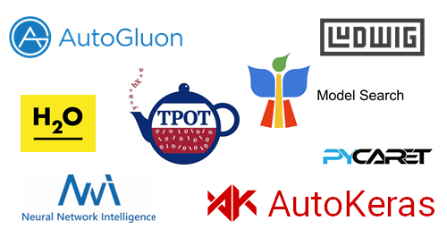
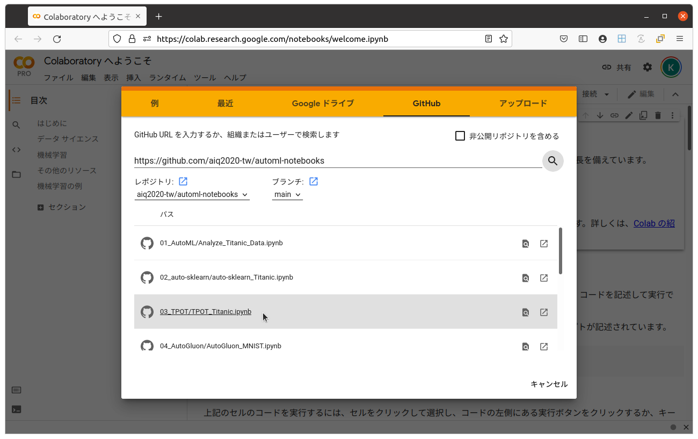

# AutoML OSSノートブック集

@IT 連載「AutoML OSS入門」用のノートブック集です。タイタニックの生存データやMNISTの手書き数字データをAutoMLで予測する実装方法を学習することができます。詳細に関しては、以下の記事を参照してください。

[@IT AutoML OSS入門（1）機械学習モデル構築作業の煩雑さを解消する「AutoML」とは――歴史、動向、利用のメリットを整理する](https://www.atmarkit.co.jp/ait/articles/2107/02/news006.html)

この連載で紹介するOSSは以下です。

 - [auto-sklearn](https://github.com/aiq2020-tw/automl-notebooks/tree/main/02_auto-sklearn)
 - [TPOT](https://github.com/aiq2020-tw/automl-notebooks/tree/main/03_TPOT)
 - [AutoGluon（Amazon）](https://github.com/aiq2020-tw/automl-notebooks/tree/main/04_AutoGluon)
 - [H2O（H2O.ai）](https://github.com/aiq2020-tw/automl-notebooks/tree/main/05_H2O)
 - [PyCaret](https://github.com/aiq2020-tw/automl-notebooks/tree/main/06_PyCaret)
 - [AutoKeras](https://github.com/aiq2020-tw/automl-notebooks/tree/main/07_AutoKeras)
 - [Ludwig（Uber）](https://github.com/aiq2020-tw/automl-notebooks/tree/main/08_Ludwig)
 - [Neural Network Intelligence（Microsoft）](https://github.com/aiq2020-tw/automl-notebooks/tree/main/09_NNI)
 - [Model Search（Google）](https://github.com/aiq2020-tw/automl-notebooks/tree/main/10_Model%20Search)

 

## 使い方

[Google Colaboratory](https://colab.research.google.com/notebooks/intro.ipynb)を表示して以下の手順を実行すると、この連載で使用可能なノートブックが表示されます。
 
1. 画面左上のメニューにある「ファイル」から「ノートブックを開く」を選択
2. 新しいウインドウが開くので、その中にある「GitHub」タブをクリック
3. 検索ボックスに「https://github.com/aiq2020-tw/automl-notebooks」と入力し、検索ボタンをクリック
4. パスに表示されたノートブックの中から興味のあるものをクリック

 
